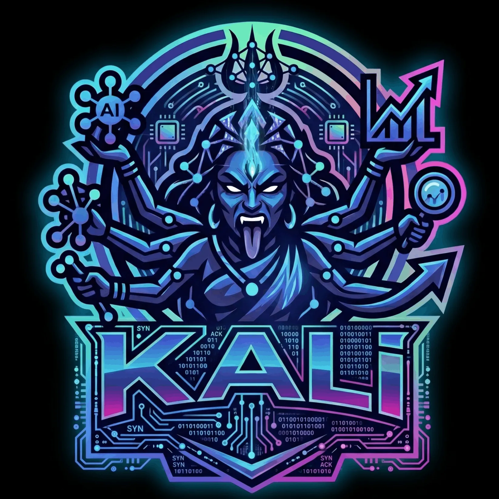

# 🔱 KALI — Intelligent Candidate Discovery & Ranking System

> **Team KALI** | Redrob Hackathon — Intelligent Candidate Discovery & Ranking Challenge

<p align="center">
  
</p>

## 🎯 Overview

An intelligent candidate ranking system that identifies the **top 100 candidates** from a pool of 100,000 for a Senior AI Engineer position at Redrob AI. The system uses a **multi-factor weighted scoring algorithm** with explicit honeypot detection and keyword-stuffer trap avoidance.

## 🏗️ Architecture

```
┌─────────────────────────────────────────────────────┐
│                  Input: candidates.jsonl.gz          │
│                    (100,000 candidates)              │
└──────────────────────┬──────────────────────────────┘
                       │
                       ▼
┌─────────────────────────────────────────────────────┐
│          PHASE 1: FAST ELIMINATION FILTER            │
│  • Honeypot Anomaly Detection                       │
│  • Experience Bounds Verification (3 - 15 yrs)      │
│  • Activity Recency check (last active <= 240 days)  │
│  • Keyword Stuffer rejection                        │
│  • Career ML Keyword presence validation             │
│  • Discards ~60% of candidates in milliseconds      │
└──────────────────────┬──────────────────────────────┘
                       │
                       ▼
┌─────────────────────────────────────────────────────┐
│       PHASE 2: MULTI-FACTOR SCORING ENGINE           │
│                                                      │
│  ┌──────────────────┐  ┌──────────────────┐         │
│  │ Title & Career   │  │ Skills Match     │         │
│  │ Relevance (35%)  │  │ (25%)            │         │
│  └──────────────────┘  └──────────────────┘         │
│  ┌──────────────────┐  ┌──────────────────┐         │
│  │ Experience Fit   │  │ Behavioral       │         │
│  │ (15%)            │  │ Signals (15%)    │         │
│  └──────────────────┘  └──────────────────┘         │
│  ┌──────────────────┐  ┌──────────────────┐         │
│  │ Location &       │  │ Education        │         │
│  │ Logistics (5%)   │  │ (5%)             │         │
│  └──────────────────┘  └──────────────────┘         │
└──────────────────────┬──────────────────────────────┘
                       │
                       ▼
┌─────────────────────────────────────────────────────┐
│          PHASE 3: REASONING GENERATION               │
│  • Grounded in specific profile attributes          │
│  • Acknowledges gaps and matches JD requirements     │
│  • Randomized sentence structures to prevent dupes   │
└──────────────────────┬──────────────────────────────┘
                       │
                       ▼
┌─────────────────────────────────────────────────────┐
│              Output: submission.csv                  │
│         (Top 100 ranked candidates)                  │
└─────────────────────────────────────────────────────┘
```

## 🚀 Quick Start

### Prerequisites
- Python 3.10+
- No external dependencies required (uses only standard library)

### Reproduce the Submission

```bash
# Clone the repository
git clone https://github.com/yash1154/intelligent-candidate-ranker.git
cd intelligent-candidate-ranker

# Run the ranker (produces submission.csv)
python rank.py --candidates ./res/candidates.jsonl.gz --out ./submission.csv

# Validate the submission
python validation/validate_submission.py submission.csv

# Deep validation (honeypot check, quality check)
python validation/deep_validate.py --csv submission.csv --candidates ./res/candidates.jsonl.gz

# Verify technical constraints (peak RAM, execution time, network sockets)
python validation/test_constraints.py --candidates ./res/candidates.jsonl.gz --out ./submission.csv
```

### Run the Demo (Gradio)

```bash
pip install gradio
python app.py
```

*Note: Locally, the app binds to `127.0.0.1` so you can open it directly via `http://localhost:7860/` on Windows. In a HuggingFace Space environment, it binds to `0.0.0.0` automatically.*

Or visit the live demo: [HuggingFace Spaces](https://huggingface.co/spaces/yash1154/intelligent-candidate-ranker)

## 📊 Methodology

### Scoring Components

| Component | Weight | What It Measures |
|-----------|--------|-----------------|
| **Title & Career Relevance** | 35% | Is the candidate actually working in AI/ML/Engineering? (Primary trap detector) |
| **Skills Match** | 25% | Do their skills match JD requirements, validated against career history? |
| **Experience Fit** | 15% | Right years of experience (5-9 sweet spot)? Product company background? |
| **Behavioral Signals** | 15% | Are they responsive, active, and available on the platform? |
| **Location & Logistics** | 5% | India-based? Short notice period? Right work mode? |
| **Education** | 5% | Relevant field of study? Institution tier? |

### Key Design Decisions

1. **3-Phase Cascade Elimination**: Speeds up the engine by filtering out ~60,000 obviously unqualified candidates in Phase 1 (checking honeypots, inactivity, stuffer metrics) before executing full scoring.

2. **Career history > Skill keywords**: We prioritize what candidates have *actually done* (titles, career descriptions) over what they *claim* in their skills list. This catches keyword-stuffer traps.

3. **Behavioral signals as a multiplier**: A perfect-on-paper candidate who is unresponsive or inactive is, for practical hiring purposes, unavailable.

4. **Honeypot detection**: Explicit checks for impossible profiles before scoring, preventing them from polluting the top 100.

5. **No ML models required**: Pure rule-based scoring runs in seconds on CPU, well within the 5-minute constraint.

## 📁 Project Structure

```
intelligent-candidate-ranker/
├── rank.py                      # Core ranking algorithm
├── app.py                       # Gradio demo for HuggingFace Spaces
├── requirements.txt             # Dependencies (for HuggingFace Spaces)
├── submission_metadata.yaml     # Hackathon submission metadata
├── submission.csv               # Generated ranking output
├── README.md                    # This file
├── .gitignore                   # Git ignore rules
├── res/                         # Resource files
│   ├── candidates.jsonl.gz      # Full candidate dataset (gzipped)
│   ├── sample_candidates.json   # Small sample for testing
│   ├── sample_submission.csv    # Format reference
│   ├── candidate_schema.json    # Candidate data schema
│   ├── submission_metadata_template.yaml
│   └── Kali_teamLogo.webp       # Team logo
└── validation/                  # Validation scripts
    ├── validate_submission.py   # Official format validator
    └── deep_validate.py         # Custom quality validator
```

## ⚡ Performance

- **Runtime**: ~30 seconds for 100K candidates on CPU
- **Memory**: <2 GB RAM usage
- **No GPU required**
- **No network calls during ranking**

## 👤 Team

**Team KALI** — Solo Participant

| Name | Role | Contact |
|------|------|---------|
| P Yashwanth Reddy | ML Engineer | yashwanthreddy1154@gmail.com |

## 🛠️ AI Tools Used

- **Gemini (Antigravity)**: Code scaffolding and architecture discussion
- **Claude**: Code review and optimization

All ranking logic was designed and iterated by the human participant. No candidate data was fed to any LLM during ranking.

## 📜 License

This project was created for the Redrob Hackathon 2026.
